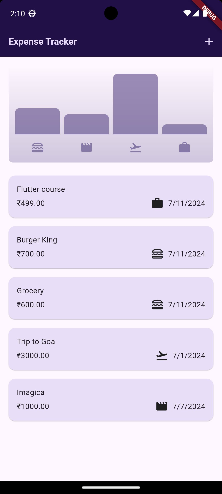
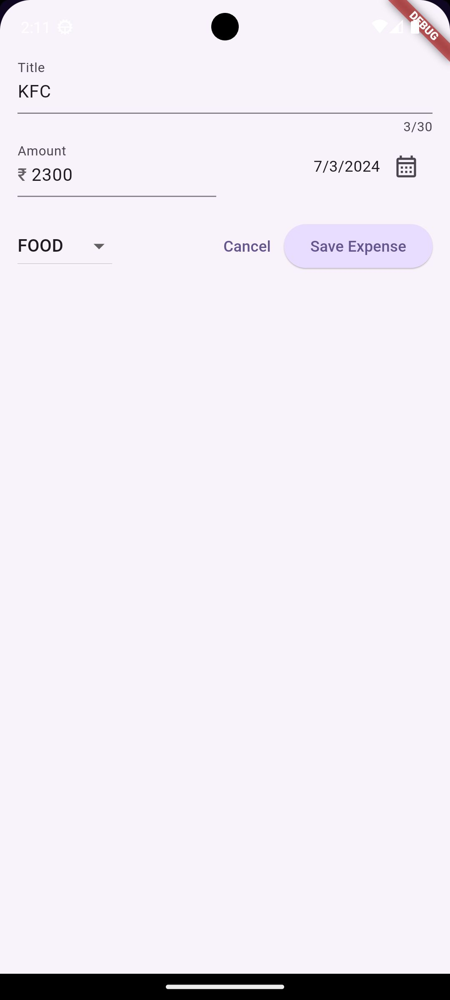

# Expense_Tracker

## Overview
Expense Tracker is a **Flutter** application designed to help users manage their daily expenses effectively. It provides an intuitive UI, real-time expense tracking, and insightful analytics.

## Features
- **Add, edit, and delete expenses**
- **Categorize expenses** for better tracking
- **Visual charts** for expense analysis
- **Responsive UI** for mobile devices

## Demo
  

